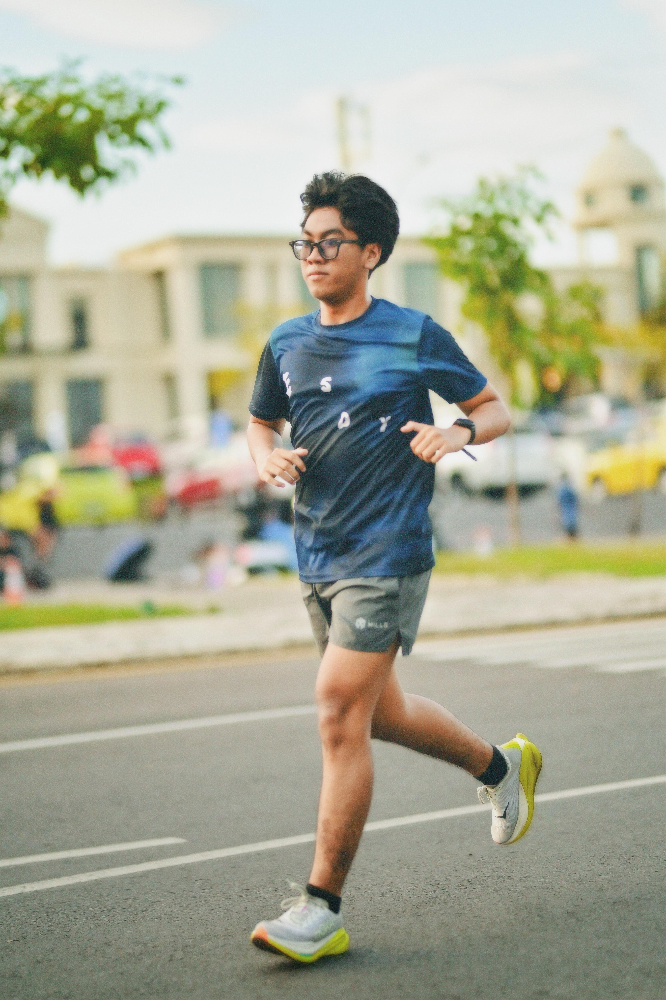

# Analisis Kode Per Baris - Website Biografi Asyraf Pramudya

## Struktur Dokumen HTML

### DOCTYPE dan HTML Tag
```html
<!DOCTYPE html>
<html lang="id">
```
- `<!DOCTYPE html>`: Deklarasi HTML5 yang memberitahu browser untuk menggunakan standar HTML5
- `<html lang="id">`: Tag pembuka HTML dengan atribut bahasa Indonesia untuk SEO dan accessibility

### HEAD Section

#### Meta Tags dan Title
```html
<head>
    <meta charset="utf-8">
    <meta name="viewport" content="width=device-width, initial-scale=1">
    <title>Biografi Saya</title>
```
- `<meta charset="utf-8">`: Mengatur encoding karakter UTF-8 untuk mendukung karakter khusus
- `<meta name="viewport" content="width=device-width, initial-scale=1">`: Konfigurasi responsive design untuk mobile
- `<title>Biografi Saya</title>`: Judul halaman yang muncul di tab browser

#### External Resources
```html
    <link rel="stylesheet" href="style.1.css">
    <link href="https://fonts.googleapis.com/css2?family=Montserrat:wght@400;600;700&display=swap" rel="stylesheet">
    <!-- Font Awesome -->
    <link rel="stylesheet" href="https://cdnjs.cloudflare.com/ajax/libs/font-awesome/6.5.0/css/all.min.css">
</head>
```
- `href="style.1.css"`: Link ke file CSS eksternal untuk styling
- Google Fonts link: Import font Montserrat dengan 3 weight (400=normal, 600=semi-bold, 700=bold)
- Font Awesome 6.5.0: Library ikon untuk social media dan contact icons

## BODY Content

### Header Section
```html
<header>
    <h1>Biografi Asyraf Pramudya</h1>
    <nav>
        <a href="#about">Tentang</a>
        <a href="#projects">Project</a>
        <a href="#skills">Keahlian</a>
        <a href="#running-schedule">Jadwal Lari</a>
        <a href="#contact">Kontak</a>
    </nav>
</header>
```
- `<header>`: Semantic HTML5 tag untuk bagian kepala halaman
- `<h1>`: Heading utama halaman (penting untuk SEO)
- `<nav>`: Container untuk navigation menu
- `href="#section-id"`: Anchor links untuk smooth scrolling ke section tertentu

### About Section
```html
<section id="about">
    <h2>Tentang Saya</h2>
    <div class="about-card">
        
        <div class="about-text">
            <p>Saya <b>Asyraf Pramudya Azhar AB</b>, seorang mahasiswa Teknik Komputer di Universitas Negeri Makassar.</p>
            <p>Hobi saya adalah design dan juga lari agar hidup terasa seimbang dan tidak monoton begitu saja.</p>
            <p>Selain lari saya juga suka musik dan bermain game</p>
        </div>
    </div>
</section>
```
- `<section id="about">`: Semantic section dengan ID untuk navigation target
- `class="about-card"`: CSS class untuk styling card layout
- ``: Gambar profil dengan alt text untuk accessibility
- `<b>`: Bold formatting untuk emphasize nama
- Multiple `<p>`: Paragraf terpisah untuk readability

### Gallery Section
```html
<section id="gallery">
    <h2>🎮 Game & 🎵 Album Musik Favorit</h2>
    <div class="gallery-cards">
        <!-- Card Game -->
        <div class="gallery-card">
            
            <h3>Favorite Games</h3>
            <center><p></p></center>
        </div>
        <!-- Card Album Musik -->
        <div class="gallery-card">
            
            <h3>Favorite Album</h3>
            <p></p>
        </div>
    </div>
</section>
```
- Emoji dalam heading: 🎮🎵 untuk visual appeal
- `class="gallery-cards"`: Container untuk card grid layout
- `<!-- Comment -->`: HTML comments untuk dokumentasi
- `<center>`: Deprecated tag (sebaiknya gunakan CSS text-align)
- Empty `<p></p>`: Placeholder content yang belum diisi

### Projects Section
```html
<section id="projects">
    <h2>Project</h2>
    <div class="projects">
        <div class="card">
            <h3>Project 1</h3>
            <p>Program manajemen stok produk sederhana dengan bahasa PHP dan fitur CRUD (Create, Read, Update, Delete) untuk memudahkan manajemen data stok produk dan pelanggan.</p>
        </div>
        <div class="card">
            <h3>Project 2</h3>
            <p>Program sewa kamar yang sedang saya kembangkan menggunakan framework Laravel dan React.js untuk tampilan interaktif.</p>
        </div>
    </div>
</section>
```
- Reusable `class="card"`: Consistent styling untuk project cards
- Technical descriptions: Menjelaskan teknologi yang digunakan (PHP, Laravel, React.js)
- CRUD explanation: Educational value dengan penjelasan singkat

### Skills Section
```html
<section id="skills">
    <h2>Keahlian</h2>
    <div class="skills">
        <p>HTML</p>
        <div class="bar"><span style="width:80%"></span></div>
        <p>CSS</p>
        <div class="bar"><span style="width:75%"></span></div>
        <p>JavaScript</p>
        <div class="bar"><span style="width:40%"></span></div>
        <p>PHP</p>
        <div class="bar"><span style="width:60%"></span></div>
    </div>
</section>
```
- Inline styling: `style="width:XX%"` untuk progress bar visualization
- Nested structure: `<div class="bar"><span></span></div>` untuk styling control
- Percentage values: Honest self-assessment dari skill level
- Progressive complexity: HTML/CSS tinggi, JS rendah (realistic)

### Running Schedule Section
```html
<section id="running-schedule">
    <h2>🏃 Jadwal Latihan Lari</h2>
    <table class="schedule-table">
        <thead>
            <tr>
                <th>Hari</th>
                <th>Jarak / Latihan</th>
                <th>Durasi (menit)</th>
                <th>Keterangan</th>
            </tr>
        </thead>
        <tbody>
            <tr>
                <td>Senin</td>
                <td>8 x 400m (Pace 3:30) / Fartlek 500m x 5</td>
                <td>60 / 30</td>
                <td>Full Effort Run (Speed Session)</td>
            </tr>
            <!-- Additional rows... -->
        </tbody>
    </table>
</section>
```
- `<table>`: Semantic HTML untuk tabular data
- `<thead>` dan `<tbody>`: Proper table structure
- Technical running terms: Pace, Fartlek, Threshold (menunjukkan expertise)
- Varied training types: Speed, Tempo, Easy, Long runs

### Contact Section
```html
<section id="contact">
    <h2>Kontak</h2>
    <div class="contact-cards">
        <div class="contact-card">
            <i class="fas fa-envelope fa-2x"></i>
            <h3>Email</h3>
            <p><a href="mailto:asrappramudya14@gmail.com">asrappramudya14@gmail.com</a></p>
        </div>
        <!-- Additional contact cards... -->
    </div>
</section>
```
- Font Awesome classes: `fas fa-envelope fa-2x` (solid, envelope, 2x size)
- `href="mailto:"`: Email protocol link
- `target="_blank"`: Opens social links in new tab
- Professional platforms: GitHub prioritized over Instagram

### Footer
```html
<footer>
    <p>Asyraf Pramudya Azhar AB - 2025</p>
    <p><b>"Semua masalah akan saya selesaikan, tapi saya lari dan ngopi dahulu"</b></p>
</footer>
```
- Copyright line dengan tahun
- Personal quote: Menunjukkan personality dan humor
- `<b>` untuk emphasize quote

# Analisis Kode CSS Per Baris - Website Biografi Asyraf Pramudya

## Global Styles & Reset

### Body & Universal Settings
```css
body {
  font-family: 'Montserrat', sans-serif;
  margin: 0;
  padding: 0;
  background: linear-gradient(135deg, #e0f7fa, #e1f5fe, #ede7f6);
  color: #333;
  scroll-behavior: smooth;
}
```
- `font-family: 'Montserrat', sans-serif;`: Font utama dari Google Fonts dengan fallback ke sans-serif
- `margin: 0; padding: 0;`: Reset default browser spacing untuk consistency
- `background: linear-gradient(135deg, ...)`: Gradient diagonal (135°) dengan warna biru muda ke ungu soft
- `color: #333;`: Warna teks default abu-abu gelap (lebih soft dari hitam)
- `scroll-behavior: smooth;`: Animasi smooth ketika navigasi dengan anchor links

### Section Layout
```css
section {
  max-width: 1000px;
  margin: 0 auto;
  padding: 2rem 1rem;
  text-align: center;
}

section p {
  text-align: justify;
}
```
- `max-width: 1000px;`: Batasan lebar maksimal untuk readability
- `margin: 0 auto;`: Center alignment horizontal dengan margin otomatis
- `padding: 2rem 1rem;`: Vertical 32px, horizontal 16px untuk breathing space
- `text-align: center;`: Default center alignment untuk headings
- `section p`: Override paragraf menjadi justify untuk readability yang lebih baik

## Header & Navigation

### Header Styling
```css
header {
  background: linear-gradient(90deg, #3f51b5, #00bcd4);
  color: white;
  padding: 1.5rem;
  text-align: center;
  box-shadow: 0 4px 8px rgba(0,0,0,0.2);
  position: sticky;
  top: 0;
  z-index: 1000;
  animation: slideDown 0.8s ease;
}
```
- `background: linear-gradient(90deg, #3f51b5, #00bcd4);`: Gradient horizontal indigo ke cyan
- `position: sticky; top: 0;`: Header tetap terlihat saat scroll (modern alternative untuk fixed)
- `z-index: 1000;`: Layer priority tinggi agar tetap di atas konten lain
- `box-shadow: 0 4px 8px rgba(0,0,0,0.2);`: Drop shadow untuk depth effect
- `animation: slideDown 0.8s ease;`: Animasi masuk dari atas

### Header Animation
```css
@keyframes slideDown {
  from { transform: translateY(-100%); opacity: 0; }
  to { transform: translateY(0); opacity: 1; }
}
```
- `translateY(-100%)`: Start position di atas viewport (tersembunyi)
- `opacity: 0`: Mulai transparan
- Transisi ke posisi normal dengan fade-in effect

### Navigation Links
```css
nav a {
  color: white;
  margin: 0 12px;
  text-decoration: none;
  font-weight: bold;
  position: relative;
  transition: color 0.3s ease;
}
```
- `text-decoration: none;`: Hapus default underline
- `position: relative;`: Untuk positioning pseudo-element underline
- `transition: color 0.3s ease;`: Smooth color change pada hover

### Navigation Hover Effect
```css
nav a::after {
  content: "";
  position: absolute;
  width: 0;
  height: 2px;
  background: #fff;
  left: 0;
  bottom: -4px;
  transition: width 0.3s ease;
}

nav a:hover {
  color: #80deea;
}

nav a:hover::after {
  width: 100%;
}
```
- `::after`: Pseudo-element untuk custom underline
- `width: 0`: Start dengan lebar 0 (invisible)
- `bottom: -4px`: Posisi 4px di bawah text
- Pada hover: warna berubah ke light blue dan underline expand ke 100%

## Profile Picture

### Base Profile Picture
```css
.profile-pic {
  width: 180px;
  height: 180px;
  border-radius: 50%;
  object-fit: cover;
  display: block;
  margin: 1rem auto;
  border: 4px solid #00bcd4;
  box-shadow: 0 4px 12px rgba(0,0,0,0.2);
  transition: transform 0.3s ease, box-shadow 0.3s ease;
  animation: fadeIn 1s ease;
}
```
- `border-radius: 50%;`: Membuat gambar circular (bulat sempurna)
- `object-fit: cover;`: Crop gambar proporsional untuk mengisi container
- `display: block; margin: 1rem auto;`: Block element dengan center alignment
- `border: 4px solid #00bcd4;`: Border cyan untuk accent
- Multiple transitions untuk smooth interactive effects

### Profile Picture Hover
```css
.profile-pic:hover {
  transform: scale(1.08) rotate(3deg);
  box-shadow: 0 6px 18px rgba(0,0,0,0.3);
}
```
- `scale(1.08)`: Perbesar 8% pada hover
- `rotate(3deg)`: Rotasi kecil untuk playful effect
- Enhanced shadow untuk lebih dramatic

### Fade In Animation
```css
@keyframes fadeIn {
  from { opacity: 0; transform: scale(0.8); }
  to { opacity: 1; transform: scale(1); }
}
```
- Kombinasi fade-in dengan scale animation
- Mulai dari 80% size dengan opacity 0

## Project Cards

### Project Grid Layout
```css
.projects {
  display: grid;
  grid-template-columns: repeat(auto-fit, minmax(280px, 1fr));
  gap: 1rem;
}
```
- `display: grid;`: Modern CSS Grid layout
- `repeat(auto-fit, minmax(280px, 1fr))`: Responsive columns, minimum 280px width
- `gap: 1rem;`: Spacing antar grid items

### Card Base Styling
```css
.card {
  background: white;
  padding: 1.2rem;
  border-radius: 10px;
  box-shadow: 0 3px 8px rgba(0,0,0,0.1);
  transition: transform 0.3s ease, box-shadow 0.3s ease;
  position: relative;
  overflow: hidden;
}
```
- `position: relative; overflow: hidden;`: Setup untuk pseudo-element animations
- Soft border-radius dan subtle shadow untuk modern card design

### Card Hover Animation
```css
.card::before {
  content: "";
  position: absolute;
  top: -50%; left: -50%;
  width: 200%; height: 200%;
  background: radial-gradient(circle, rgba(63,81,181,0.15) 20%, transparent 70%);
  transform: scale(0);
  transition: transform 0.5s ease;
  z-index: 0;
}

.card:hover::before {
  transform: scale(1);
}

.card:hover {
  transform: translateY(-8px);
  box-shadow: 0 8px 20px rgba(0,0,0,0.25);
}
```
- `::before`: Pseudo-element untuk background effect
- Radial gradient overlay yang expand pada hover
- `translateY(-8px)`: Lift effect saat hover
- `z-index: 0`: Background effect di belakang content

## Skills Section

### Skills Container
```css
.skills {
  text-align: left;
}
```
- Override default center alignment untuk skill bars

### Progress Bar Container
```css
.skills .bar {
  background: #ddd;
  border-radius: 20px;
  overflow: hidden;
  margin: 0.5rem 0 1rem;
}
```
- `background: #ddd;`: Light gray background untuk track
- `border-radius: 20px;`: Rounded corners untuk modern look
- `overflow: hidden;`: Ensure rounded corners pada span element

### Progress Bar Fill
```css
.skills .bar span {
  display: block;
  height: 14px;
  background: linear-gradient(90deg, #3f51b5, #00bcd4);
  border-radius: 20px;
  animation: growBar 2s ease forwards;
}
```
- `height: 14px;`: Fixed height untuk consistency
- Gradient background matching header colors
- `animation: growBar 2s ease forwards;`: Growing animation

### Progress Bar Animation
```css
@keyframes growBar {
  from { width: 0; }
}
```
- Simple animation dari 0 width ke inline-defined width
- `forwards`: Maintain final state setelah animation selesai

## Running Schedule Table

### Table Base Styling
```css
.schedule-table {
  width: 100%;
  border-collapse: collapse;
  margin-top: 1rem;
  font-size: 0.95rem;
  animation: fadeIn 1.2s ease;
}
```
- `border-collapse: collapse;`: Menggabungkan borders untuk clean look
- `font-size: 0.95rem;`: Slightly smaller untuk fit more content

### Table Cells
```css
.schedule-table th,
.schedule-table td {
  border: 1px solid #ccc;
  padding: 0.75rem;
  text-align: center;
}
```
- Consistent padding dan border untuk semua cells
- Center alignment untuk tabular data

### Table Header
```css
.schedule-table th {
  background: #3f51b5;
  color: #fff;
  text-transform: uppercase;
}
```
- Indigo background matching theme
- `text-transform: uppercase;`: Professional table header styling

### Table Row Styling
```css
.schedule-table tr:nth-child(even) {
  background: #e3f2fd;
}

.schedule-table tr:hover {
  background: #b3e5fc;
  transform: scale(1.02);
  transition: 0.3s ease;
}
```
- `nth-child(even)`: Zebra striping untuk readability
- Hover effect dengan scale dan color change
- Subtle interactive feedback

## Contact Cards

### Contact Grid
```css
.contact-cards {
  display: grid;
  grid-template-columns: repeat(auto-fit, minmax(250px, 1fr));
  gap: 1rem;
  margin-top: 1rem;
}
```
- Responsive grid dengan minimum 250px per card
- Consistent gap spacing

### Contact Card Styling
```css
.contact-card {
  background: white;
  padding: 1.5rem;
  border-radius: 12px;
  box-shadow: 0 3px 8px rgba(0,0,0,0.1);
  text-align: center;
  transition: transform 0.3s ease, box-shadow 0.3s ease;
  border-left: 6px solid #00bcd4;
  position: relative;
  overflow: hidden;
}
```
- `border-left: 6px solid #00bcd4;`: Accent border untuk visual hierarchy
- Larger padding untuk comfortable spacing

### Contact Card Animations
```css
.contact-card::after {
  content: "";
  position: absolute;
  top: 0; left: 0;
  width: 100%; height: 100%;
  background: rgba(0,188,212,0.05);
  transform: translateX(-100%);
  transition: transform 0.3s ease;
}

.contact-card:hover::after {
  transform: translateX(0);
}

.contact-card:hover {
  transform: translateY(-6px) scale(1.03);
  box-shadow: 0 6px 20px rgba(0,0,0,0.2);
}
```
- Slide-in overlay effect dari kiri ke kanan
- Combined lift dan scale effect pada hover

### Contact Links
```css
.contact-card a {
  color: #333;
  text-decoration: none;
  font-weight: 500;
}

.contact-card a:hover {
  color: #00bcd4;
  text-decoration: underline;
}
```
- Consistent styling dengan theme colors
- Clear hover states untuk UX

## Footer

### Footer Styling
```css
footer {
  background: #3f51b5;
  color: #fff;
  text-align: center;
  padding: 1rem;
  margin-top: 2rem;
  font-style: italic;
  letter-spacing: 1px;
  animation: fadeIn 1.5s ease;
}
```
- Matching indigo background dengan header
- `font-style: italic;`: Stylistic choice untuk quotes
- `letter-spacing: 1px;`: Improved readability untuk footer text

## About Section

### About Card Layout
```css
.about-card {
  background: white;
  padding: 2rem;
  border-radius: 15px;
  box-shadow: 0 4px 12px rgba(0,0,0,0.15);
  display: flex;
  align-items: center;
  gap: 2rem;
  max-width: 800px;
  margin: 2rem auto;
  transition: transform 0.3s ease, box-shadow 0.3s ease;
}
```
- `display: flex; align-items: center;`: Horizontal layout dengan vertical centering
- `gap: 2rem;`: Modern CSS gap property untuk spacing
- Larger border-radius untuk softer appearance

### About Card Profile Picture
```css
.about-card .profile-pic {
  width: 150px;
  height: 150px;
  border-radius: 50%;
  border: 4px solid #00c851;
  object-fit: cover;
  box-shadow: 0 3px 10px rgba(0,0,0,0.2);
  transition: transform 0.3s ease;
}
```
- Different size (150px) untuk about section
- Green border (`#00c851`) untuk variation
- Specific styling untuk context

### About Text Styling
```css
.about-card .about-text {
  flex: 1;
  font-size: 1.05rem;
  line-height: 1.6;
  color: #333;
}
```
- `flex: 1;`: Take remaining space dalam flex container
- `line-height: 1.6;`: Optimal untuk readability
- Slightly larger font size untuk importance

## Gallery Section

### Gallery Grid
```css
.gallery-cards {
  display: flex;
  justify-content: center;
  gap: 1.5rem;
  flex-wrap: wrap;
}
```
- `display: flex;`: Flexible layout untuk gallery items
- `justify-content: center;`: Center alignment untuk gallery
- `flex-wrap: wrap;`: Responsive wrapping pada mobile

### Gallery Card
```css
.gallery-card {
  text-align: center;
  background: white;
  padding: 1rem;
  border-radius: 10px;
  box-shadow: 0 3px 8px rgba(0,0,0,0.1);
  transition: transform 0.3s ease, box-shadow 0.3s ease;
  max-width: 250px;
}

.gallery-img {
  width: 100%;
  height: auto;
  border-radius: 8px;
  margin-bottom: 0.5rem;
}
```
- Consistent card styling dengan project cards
- `max-width: 250px;`: Limit size untuk better proportion
- Responsive image dengan rounded corners

