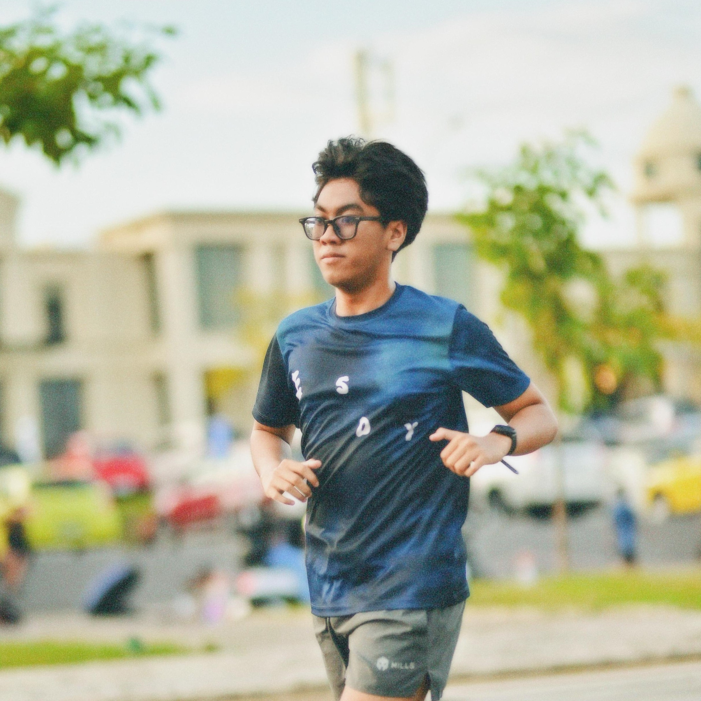
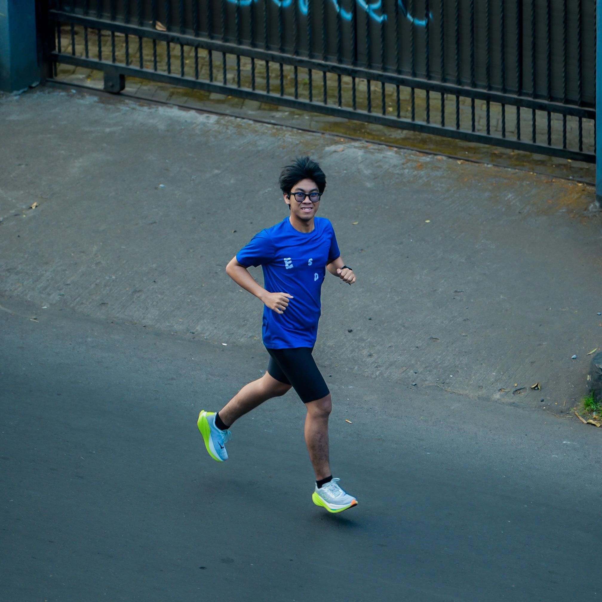
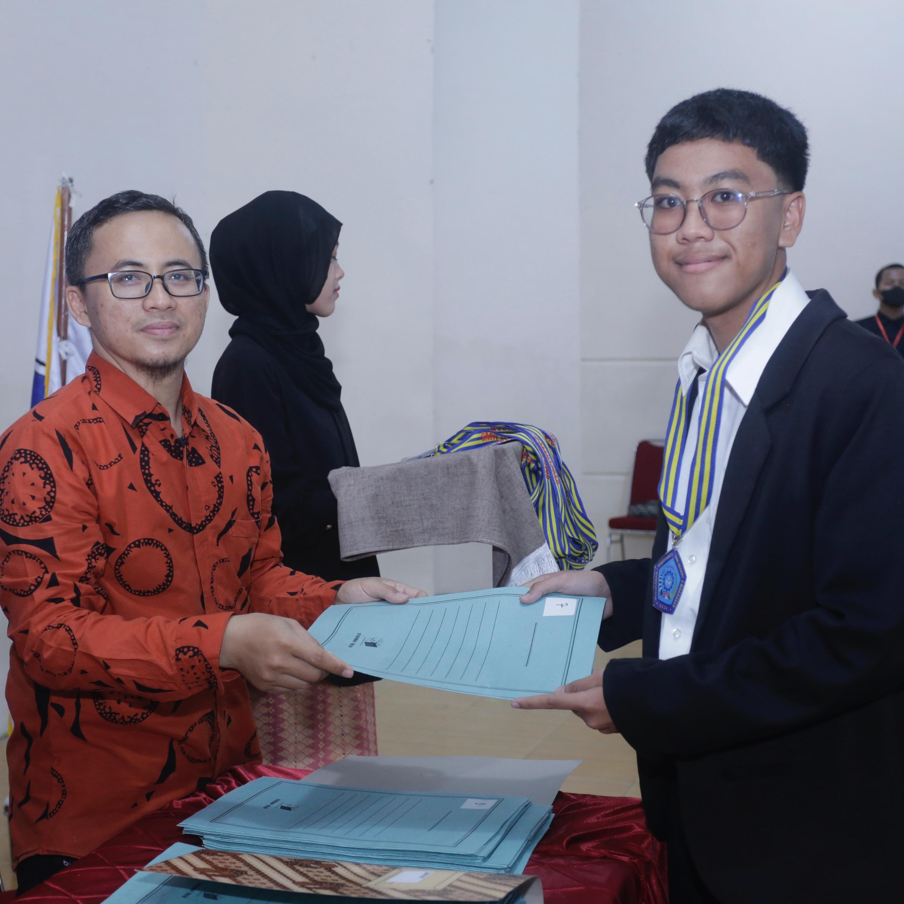
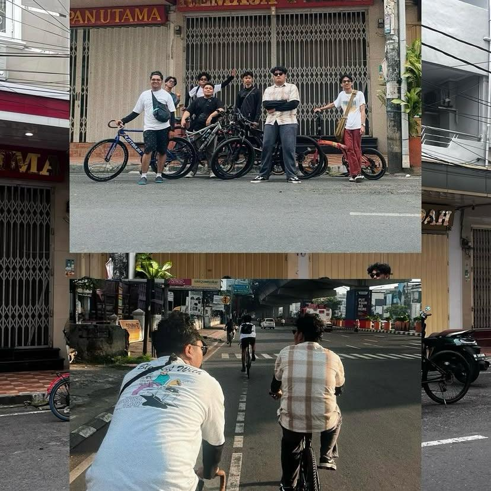

# Analisa Kode Program Portofolio.html


---

## Struktur File
```
├── portofolio.html     # Halaman utama portfolio
├── gallery.html        # Halaman galeri (file yang Anda berikan)
├── style.1.css         # File CSS untuk styling
└── assets/             # Folder gambar
    ├── pasfoto.jpg
    ├── profil.jpg
    ├── lare.jpg
    ├── wisuda.jpg
    └── adabikenya.jpg
```

---

## Penjelasan Kode HTML (gallery.html)

### 1. Struktur Dokumen HTML
```html
<!DOCTYPE html>
<html lang="id">
```
- `<!DOCTYPE html>`: Deklarasi dokumen HTML5
- `<html lang="id">`: Tag pembuka HTML dengan bahasa Indonesia

### 2. Head Section
```html
<head>
    <meta charset="utf-8">
    <meta name="viewport" content="width=device-width, initial-scale=1">
    <title>Galeri Saya</title>
    <link rel="stylesheet" href="style.1.css">
    <link href="https://fonts.googleapis.com/css2?family=Montserrat:wght@400;600;700&display=swap" rel="stylesheet">
    <link rel="stylesheet" href="https://cdnjs.cloudflare.com/ajax/libs/font-awesome/6.5.0/css/all.min.css">
</head>
```
- `<meta charset="utf-8">`: Mengatur encoding karakter UTF-8
- `<meta name="viewport"...>`: Membuat website responsive untuk mobile
- `<title>`: Judul halaman yang muncul di tab browser
- `<link rel="stylesheet" href="style.1.css">`: Menghubungkan file CSS lokal
- `<link href="https://fonts.googleapis.com...">`: Mengimpor font Montserrat dari Google Fonts
- `<link rel="stylesheet" href="https://cdnjs...">`: Mengimpor Font Awesome untuk ikon

### 3. Header Navigation
```html
<header>
    <h1>Galeri</h1>
    <nav>
        <a href="portofolio.html">Beranda</a>
    </nav>
</header>
```
- `<header>`: Bagian header halaman
- `<h1>Galeri</h1>`: Judul utama halaman
- `<nav>`: Navigasi dengan link kembali ke halaman beranda

### 4. Section Profile
```html
<section id="profile">
    <h2>About me</h2>
    <div class="gallery-cards">
```
- `<section id="profile">`: Container utama untuk konten profil
- `<h2>About me</h2>`: Judul section
- `<div class="gallery-cards">`: Container untuk kartu-kartu galeri (menggunakan CSS Grid)

### 5. Gallery Card 1 - Biografi
```html
<div class="gallery-card">
    
    <h3>Biografi</h3>
    <p>Saya Asyraf Pramudya Azhar AB, Lahir pada 14 Agustus 2006 Di Makassar.</p>
    <p>Saya adalah anak 3 dari 4 bersaudara, saya berdomisili Makassar 
        tepatnya Jl. Tamalate 1 Kecamatan Rappocini</p>
</div>
```
- `<div class="gallery-card">`: Container untuk satu kartu galeri
- ``: Gambar profil dengan alt text dan class CSS
- `<h3>Biografi</h3>`: Judul kartu
- `<p>`: Paragraf berisi informasi biografis

### 6. Gallery Card 2 - Hobi
```html
<div class="gallery-card">
    
    <h3>Hobi</h3>
    <p>Hobi saya ialah berlari, bermain game, design UI/UX, dan juga mendengarkan musik.</p>
</div>
```
- Struktur sama dengan card sebelumnya
- Berisi informasi tentang hobi dengan gambar terkait

### 7. Gallery Card 3 - Jenjang Pendidikan
```html
<div class="gallery-card">
    
    <h3>Jenjang Pendidikan</h3>
    <p>Saya merupakan alumni dari SMKN 2 Makassar Jurusan RPL (Rekayasa Perangkat Lunak) dan saya lulus pada tahun 2024.</p>
    <p>Saya juga merupakan alumni dari MTsN 1 Makassar dan lulus pada tahun 2021</p>
</div>
```
- Berisi informasi riwayat pendidikan
- Menggunakan gambar wisuda sebagai ilustrasi

### 8. Gallery Card 4 - Komunitas
```html
<div class="gallery-card">
    
    <h3>Komunitas</h3>
    <p>Saya juga memiliki komunitas sepeda yaitu @ada.bikenya yang beranggotakan 8 orang
        kami selalu melakukan sepeda rutin setiap minggu dengan rute bervariatif sembari
        membuka ajakan gowes bersama.</p>
</div>
```
- Berisi informasi tentang komunitas sepeda
- Menunjukkan aktivitas sosial dan organisasi

### 9. Footer
```html
<footer>
    <p>Asyraf Pramudya Azhar AB - 2025</p>
    <p><b>"Semua masalah akan saya selesaikan, tapi saya lari dan ngopi dahulu"</b></p>
</footer>
```
- `<footer>`: Bagian footer website
- Berisi copyright dan quote personal yang memorable

## Interaksi JavaScript

### 1. Button Navigation
```javascript
onclick="window.location.href='gallery.html'"
```
- **Fungsi**: Navigasi ke halaman galeri
- **Event**: Onclick event handler
- **Method**: `window.location.href` untuk redirect halaman
- **Target**: File `gallery.html`

### 2. Smooth Scroll Navigation
```html
<a href="#about">Tentang</a>
<a href="#projects">Project</a>
```
- **Fungsi**: Navigasi internal dalam halaman
- **Behavior**: CSS `scroll-behavior: smooth` untuk animasi halus
- **Target**: ID elements dalam halaman yang sama

---

## Analisis Fungsionalitas Website

### 🎯 **Tujuan Website**
- Menampilkan portfolio profesional
- Showcase skill programming dan design
- Menunjukkan kepribadian melalui hobi (lari, musik, game)
- Memberikan informasi kontak yang jelas

### 📊 **Content Strategy**
1. **Personal Branding**: Foto profil dan quote personal
2. **Technical Skills**: Progress bar untuk keahlian programming
3. **Project Showcase**: Deskripsi project PHP dan Laravel
4. **Lifestyle**: Jadwal lari yang menunjukkan dedikasi
5. **Accessibility**: Multiple contact methods (email, GitHub, Instagram)

### 🎨 **Design Philosophy**
- **Modern Minimalist**: Clean layout dengan white space yang cukup
- **Color Psychology**: Biru untuk kepercayaan dan profesionalisme
- **Visual Hierarchy**: Typography dan spacing yang jelas
- **Interactive Elements**: Hover effects dan smooth transitions

---

## Penjelasan CSS Penting

### 1. Layout System
```css
/* Section Center */
section {
    max-width: 1000px;
    margin: 0 auto;
    padding: 2rem 1rem;
    text-align: center;
}
```
- **Centered Layout**: `margin: 0 auto` untuk center content
- **Max Width**: Batas maksimal 1000px untuk readability
- **Consistent Padding**: 2rem vertikal, 1rem horizontal
- **Text Alignment**: Default center dengan justify untuk paragraph

### 2. Header Sticky Navigation
```css
header {
    position: sticky;
    top: 0;
    z-index: 1000;
    animation: slideDown 0.8s ease;
}
```
- **Sticky Position**: Header tetap terlihat saat scroll
- **Z-index**: Layer priority tinggi
- **Slide Animation**: Efek masuk dari atas

### 3. Card Hover Effects
```css
.card::before {
    content: "";
    position: absolute;
    background: radial-gradient(circle, rgba(63,81,181,0.15) 20%, transparent 70%);
    transform: scale(0);
    transition: transform 0.5s ease;
}

.card:hover::before {
    transform: scale(1);
}
```
- **Pseudo Element**: `::before` untuk background effect
- **Radial Gradient**: Efek lingkaran cahaya
- **Scale Transform**: Animasi membesar dari 0 ke 1
- **Smooth Transition**: 0.5s ease timing

### 4. Skill Progress Bars
```css
.skills .bar span {
    display: block;
    height: 14px;
    background: linear-gradient(90deg, #3f51b5, #00bcd4);
    animation: growBar 2s ease forwards;
}

@keyframes growBar {
    from { width: 0; }
}
```
- **Animated Progress**: CSS animation dari 0 width
- **Gradient Background**: Visual appeal dengan warna theme
- **Keyframe Animation**: `growBar` dengan timing 2 detik
- **Forwards Fill**: Mempertahankan state akhir animasi

### 5. Responsive Grid System
```css
/* Projects Grid */
.projects {
    display: grid;
    grid-template-columns: repeat(auto-fit, minmax(280px, 1fr));
    gap: 1rem;
}

/* Gallery Grid */
.gallery-cards {
    display: grid;
    grid-template-columns: repeat(4, 1fr);
    gap: 20px;
}

/* Responsive Breakpoints */
@media (max-width: 1024px) {
    .gallery-cards {
        grid-template-columns: repeat(2, 1fr);
    }
}

@media (max-width: 600px) {
    .gallery-cards {
        grid-template-columns: 1fr;
    }
}
```
- **CSS Grid**: Modern layout system
- **Auto-fit**: Otomatis adjust kolom berdasarkan space
- **Minmax**: Minimum 280px, maksimum 1fr (flexible)
- **Media Queries**: Responsive design untuk berbagai device

### 6. Advanced Animations
```css
/* Profile Picture Hover */
.profile-pic:hover {
    transform: scale(1.08) rotate(3deg);
    box-shadow: 0 6px 18px rgba(0,0,0,0.3);
}

/* Table Row Hover */
.schedule-table tr:hover {
    background: #b3e5fc;
    transform: scale(1.02);
    transition: 0.3s ease;
}
```
- **Multi Transform**: Scale dan rotate bersamaan
- **Dynamic Shadow**: Perubahan box-shadow pada hover
- **Table Interactivity**: Hover effect pada baris tabel
- **Subtle Scale**: Transform scale kecil (1.02) untuk subtlety

---


# Analisa Kode Program Gallery.html

---

## Struktur File
```
├── portofolio.html     # Halaman utama portfolio
├── gallery.html        # Halaman galeri (file yang Anda berikan)
├── style.1.css         # File CSS untuk styling
└── assets/             # Folder gambar
    ├── pasfoto.jpg
    ├── profil.jpg
    ├── lare.jpg
    ├── wisuda.jpg
    └── adabikenya.jpg
```

---

## Penjelasan Kode HTML (gallery.html)

### 1. Struktur Dokumen HTML
```html
<!DOCTYPE html>
<html lang="id">
```
- `<!DOCTYPE html>`: Deklarasi dokumen HTML5
- `<html lang="id">`: Tag pembuka HTML dengan bahasa Indonesia

### 2. Head Section
```html
<head>
    <meta charset="utf-8">
    <meta name="viewport" content="width=device-width, initial-scale=1">
    <title>Galeri Saya</title>
    <link rel="stylesheet" href="style.1.css">
    <link href="https://fonts.googleapis.com/css2?family=Montserrat:wght@400;600;700&display=swap" rel="stylesheet">
    <link rel="stylesheet" href="https://cdnjs.cloudflare.com/ajax/libs/font-awesome/6.5.0/css/all.min.css">
</head>
```
- `<meta charset="utf-8">`: Mengatur encoding karakter UTF-8
- `<meta name="viewport"...>`: Membuat website responsive untuk mobile
- `<title>`: Judul halaman yang muncul di tab browser
- `<link rel="stylesheet" href="style.1.css">`: Menghubungkan file CSS lokal
- `<link href="https://fonts.googleapis.com...">`: Mengimpor font Montserrat dari Google Fonts
- `<link rel="stylesheet" href="https://cdnjs...">`: Mengimpor Font Awesome untuk ikon

### 3. Header Navigation
```html
<header>
    <h1>Galeri</h1>
    <nav>
        <a href="portofolio.html">Beranda</a>
    </nav>
</header>
```
- `<header>`: Bagian header halaman
- `<h1>Galeri</h1>`: Judul utama halaman
- `<nav>`: Navigasi dengan link kembali ke halaman beranda

### 4. Section Profile
```html
<section id="profile">
    <h2>About me</h2>
    <div class="gallery-cards">
```
- `<section id="profile">`: Container utama untuk konten profil
- `<h2>About me</h2>`: Judul section
- `<div class="gallery-cards">`: Container untuk kartu-kartu galeri (menggunakan CSS Grid)

### 5. Gallery Card 1 - Biografi
```html
<div class="gallery-card">
    
    <h3>Biografi</h3>
    <p>Saya Asyraf Pramudya Azhar AB, Lahir pada 14 Agustus 2006 Di Makassar.</p>
    <p>Saya adalah anak 3 dari 4 bersaudara, saya berdomisili Makassar 
        tepatnya Jl. Tamalate 1 Kecamatan Rappocini</p>
</div>
```
- `<div class="gallery-card">`: Container untuk satu kartu galeri
- ``: Gambar profil dengan alt text dan class CSS
- `<h3>Biografi</h3>`: Judul kartu
- `<p>`: Paragraf berisi informasi biografis

### 6. Gallery Card 2 - Hobi
```html
<div class="gallery-card">
    
    <h3>Hobi</h3>
    <p>Hobi saya ialah berlari, bermain game, design UI/UX, dan juga mendengarkan musik.</p>
</div>
```
- Struktur sama dengan card sebelumnya
- Berisi informasi tentang hobi dengan gambar terkait

### 7. Gallery Card 3 - Jenjang Pendidikan
```html
<div class="gallery-card">
    
    <h3>Jenjang Pendidikan</h3>
    <p>Saya merupakan alumni dari SMKN 2 Makassar Jurusan RPL (Rekayasa Perangkat Lunak) dan saya lulus pada tahun 2024.</p>
    <p>Saya juga merupakan alumni dari MTsN 1 Makassar dan lulus pada tahun 2021</p>
</div>
```
- Berisi informasi riwayat pendidikan
- Menggunakan gambar wisuda sebagai ilustrasi

### 8. Gallery Card 4 - Komunitas
```html
<div class="gallery-card">
    
    <h3>Komunitas</h3>
    <p>Saya juga memiliki komunitas sepeda yaitu @ada.bikenya yang beranggotakan 8 orang
        kami selalu melakukan sepeda rutin setiap minggu dengan rute bervariatif sembari
        membuka ajakan gowes bersama.</p>
</div>
```
- Berisi informasi tentang komunitas sepeda
- Menunjukkan aktivitas sosial dan organisasi

### 9. Footer
```html
<footer>
    <p>Asyraf Pramudya Azhar AB - 2025</p>
    <p><b>"Semua masalah akan saya selesaikan, tapi saya lari dan ngopi dahulu"</b></p>
</footer>
```
- `<footer>`: Bagian footer website
- Berisi copyright dan quote personal yang memorable

---

## Penjelasan CSS Penting

### 1. Layout Gallery Cards
```css
.gallery-cards {
    display: grid;
    grid-template-columns: repeat(4, 1fr);
    gap: 20px;
    margin-top: 20px;
}
```
- Menggunakan CSS Grid untuk layout 4 kolom sejajar
- `gap: 20px`: Jarak antar kartu
- Responsive design dengan media queries

### 2. Styling Gallery Card
```css
.gallery-card {
    background: #fff;
    border-radius: 10px;
    overflow: hidden;
    box-shadow: 0 4px 8px rgba(0,0,0,0.1);
    text-align: center;
    padding: 15px;
}
```
- Background putih dengan border radius
- Shadow untuk efek depth
- Padding untuk spacing internal

### 3. Responsive Design
```css
@media (max-width: 1024px) {
    .gallery-cards {
        grid-template-columns: repeat(2, 1fr);
    }
}

@media (max-width: 600px) {
    .gallery-cards {
        grid-template-columns: 1fr;
    }
}
```
- Tablet: 2 kolom
- Mobile: 1 kolom
- Memastikan tampilan optimal di semua device

---

# Analisis Kode CSS

## Gambaran Umum
File CSS ini membuat website portfolio personal yang modern dan responsif dengan tema biru dingin, animasi halus, dan elemen-elemen interaktif. Desainnya menggunakan gradient background, efek hover, dan sistem layout berbasis grid.

## Analisis Struktur Kode

### 1. Gaya Global (Baris 1-9)

```css
/* Tema Umum */
body {
  font-family: 'Montserrat', sans-serif;
  margin: 0;
  padding: 0;
  background: linear-gradient(135deg, #e0f7fa, #e1f5fe, #ede7f6);
  color: #333;
  scroll-behavior: smooth;
}
```

**Penjelasan:**
- **Baris 2**: Mengatur font Montserrat sebagai font utama (Google Fonts)
- **Baris 3-4**: Menghilangkan margin dan padding default browser
- **Baris 5**: Membuat gradient latar belakang diagonal dengan warna biru/cyan muda
- **Baris 6**: Mengatur warna teks default menjadi abu-abu gelap (#333)
- **Baris 7**: Mengaktifkan smooth scrolling untuk navigasi anchor

### 2. Layout Section (Baris 11-20)

```css
/* Section Center */
section {
  max-width: 1000px;
  margin: 0 auto;
  padding: 2rem 1rem;
  text-align: center;
}

section p {
  text-align: justify;
}
```

**Penjelasan:**
- **Baris 13**: Membatasi lebar section maksimal 1000px untuk keterbacaan
- **Baris 14**: Menengahkan section secara horizontal
- **Baris 15**: Menambah padding responsif (2rem atas/bawah, 1rem kiri/kanan)
- **Baris 16**: Menengahkan konten dalam section
- **Baris 19**: Mengatur teks paragraf rata kiri-kanan untuk kemudahan baca

### 3. Styling Header (Baris 22-43)

```css
/* Header dingin */
header {
  background: linear-gradient(90deg, #3f51b5, #00bcd4);
  color: white;
  padding: 1.5rem;
  text-align: center;
  box-shadow: 0 4px 8px rgba(0,0,0,0.2);
  position: sticky;
  top: 0;
  z-index: 1000;
  animation: slideDown 0.8s ease;
}

@keyframes slideDown {
  from { transform: translateY(-100%); opacity: 0; }
  to { transform: translateY(0); opacity: 1; }
}
```

**Penjelasan:**
- **Baris 24**: Gradient horizontal dari indigo ke cyan
- **Baris 25**: Teks berwarna putih untuk kontras
- **Baris 27**: Bayangan halus untuk efek kedalaman
- **Baris 28-30**: Membuat header sticky di atas dengan z-index tinggi
- **Baris 31**: Animasi slideDown saat halaman dimuat
- **Baris 34-37**: Definisi animasi geser turun dari atas

### 4. Navigasi Header (Baris 45-69)

```css
nav a {
  color: white;
  margin: 0 12px;
  text-decoration: none;
  font-weight: bold;
  position: relative;
  transition: color 0.3s ease;
}

nav a::after {
  content: "";
  position: absolute;
  width: 0;
  height: 2px;
  background: #fff;
  left: 0;
  bottom: -4px;
  transition: width 0.3s ease;
}

nav a:hover {
  color: #80deea;
}

nav a:hover::after {
  width: 100%;
}
```

**Penjelasan:**
- **Baris 46-51**: Styling dasar link navigasi dengan font tebal dan transisi
- **Baris 53-61**: Membuat garis bawah animasi menggunakan pseudo-element ::after
- **Baris 63-65**: Mengubah warna link saat hover
- **Baris 67-69**: Menganimasikan garis bawah dari 0% ke 100% saat hover

### 5. Foto Profil (Baris 71-90)

```css
.profile-pic {
  width: 180px;
  height: 180px;
  border-radius: 50%;
  object-fit: cover;
  display: block;
  margin: 1rem auto;
  border: 4px solid #00bcd4;
  box-shadow: 0 4px 12px rgba(0,0,0,0.2);
  transition: transform 0.3s ease, box-shadow 0.3s ease;
  animation: fadeIn 1s ease;
}

.profile-pic:hover {
  transform: scale(1.08) rotate(3deg);
  box-shadow: 0 6px 18px rgba(0,0,0,0.3);
}

@keyframes fadeIn {
  from { opacity: 0; transform: scale(0.8); }
  to { opacity: 1; transform: scale(1); }
}
```

**Penjelasan:**
- **Baris 72-73**: Ukuran foto 180x180 piksel
- **Baris 74**: Membuat foto berbentuk lingkaran
- **Baris 75**: Mempertahankan rasio aspek foto
- **Baris 78**: Border cyan 4px
- **Baris 79**: Bayangan lembut
- **Baris 83-85**: Efek hover: memperbesar dan memutar sedikit
- **Baris 87-90**: Animasi fade in saat halaman dimuat

### 6. Card Project (Baris 92-131)

```css
.projects {
  display: grid;
  grid-template-columns: repeat(auto-fit, minmax(280px, 1fr));
  gap: 1rem;
}

.card {
  background: white;
  padding: 1.2rem;
  border-radius: 10px;
  box-shadow: 0 3px 8px rgba(0,0,0,0.1);
  transition: transform 0.3s ease, box-shadow 0.3s ease;
  position: relative;
  overflow: hidden;
}
```

**Penjelasan:**
- **Baris 93-95**: Grid responsif dengan kolom minimal 280px
- **Baris 96**: Jarak antar card 1rem
- **Baris 99-106**: Styling dasar card dengan background putih dan border-radius
- **Baris 107**: Posisi relatif untuk pseudo-element

### 7. Efek Hover Card (Baris 109-131)

```css
.card::before {
  content: "";
  position: absolute;
  top: -50%;
  left: -50%;
  width: 200%;
  height: 200%;
  background: radial-gradient(circle, rgba(63,81,181,0.15) 20%, transparent 70%);
  transform: scale(0);
  transition: transform 0.5s ease;
  z-index: 0;
}

.card:hover::before {
  transform: scale(1);
}

.card:hover {
  transform: translateY(-8px);
  box-shadow: 0 8px 20px rgba(0,0,0,0.25);
}
```

**Penjelasan:**
- **Baris 110-118**: Pseudo-element untuk efek background radial saat hover
- **Baris 122-124**: Mengaktifkan efek background radial
- **Baris 126-129**: Card terangkat ke atas dengan bayangan lebih kuat saat hover

### 8. Bar Keahlian (Baris 138-159)

```css
.skills {
  text-align: left;
}

.skills .bar {
  background: #ddd;
  border-radius: 20px;
  overflow: hidden;
  margin: 0.5rem 0 1rem;
}

.skills .bar span {
  display: block;
  height: 14px;
  background: linear-gradient(90deg, #3f51b5, #00bcd4);
  border-radius: 20px;
  animation: growBar 2s ease forwards;
}

@keyframes growBar {
  from { width: 0; }
}
```

**Penjelasan:**
- **Baris 139**: Teks skill rata kiri
- **Baris 142-146**: Container bar dengan background abu-abu dan border-radius
- **Baris 148-153**: Bar progress dengan gradient dan animasi
- **Baris 155-157**: Animasi bar tumbuh dari 0% hingga nilai yang ditentukan

### 9. Jadwal Lari Table (Baris 161-185)

```css
.schedule-table {
  width: 100%;
  border-collapse: collapse;
  margin-top: 1rem;
  font-size: 0.95rem;
  animation: fadeIn 1.2s ease;
}

.schedule-table th,
.schedule-table td {
  border: 1px solid #ccc;
  padding: 0.75rem;
  text-align: center;
}

.schedule-table th {
  background: #3f51b5;
  color: #fff;
  text-transform: uppercase;
}

.schedule-table tr:nth-child(even) {
  background: #e3f2fd;
}

.schedule-table tr:hover {
  background: #b3e5fc;
  transform: scale(1.02);
  transition: 0.3s ease;
}
```

**Penjelasan:**
- **Baris 162-166**: Styling dasar table dengan collapse border
- **Baris 168-172**: Styling cell dengan border dan padding
- **Baris 174-177**: Header table dengan background indigo
- **Baris 179-181**: Baris genap dengan background biru muda
- **Baris 183-187**: Efek hover pada baris table

### 10. Contact Cards (Baris 189-231)

```css
.contact-cards {
  display: grid;
  grid-template-columns: repeat(auto-fit, minmax(250px, 1fr));
  gap: 1rem;
  margin-top: 1rem;
}

.contact-card {
  background: white;
  padding: 1.5rem;
  border-radius: 12px;
  box-shadow: 0 3px 8px rgba(0,0,0,0.1);
  text-align: center;
  transition: transform 0.3s ease, box-shadow 0.3s ease;
  border-left: 6px solid #00bcd4;
  position: relative;
  overflow: hidden;
}
```

**Penjelasan:**
- **Baris 190-192**: Grid responsif untuk contact cards
- **Baris 196-205**: Styling dasar card dengan border kiri cyan sebagai aksen
- **Baris 206**: Position relative untuk efek overlay

### 11. Contact Card Hover Effects (Baris 207-231)

```css
.contact-card::after {
  content: "";
  position: absolute;
  top: 0; left: 0;
  width: 100%; height: 100%;
  background: rgba(0,188,212,0.05);
  transform: translateX(-100%);
  transition: transform 0.3s ease;
}

.contact-card:hover::after {
  transform: translateX(0);
}

.contact-card:hover {
  transform: translateY(-6px) scale(1.03);
  box-shadow: 0 6px 20px rgba(0,0,0,0.2);
}
```

**Penjelasan:**
- **Baris 208-215**: Overlay transparan yang bergeser dari kiri
- **Baris 217-219**: Mengaktifkan overlay saat hover
- **Baris 221-224**: Efek terangkat dan sedikit membesar saat hover

### 12. Footer Styling (Baris 243-253)

```css
footer {
  background: #3f51b5;
  color: #fff;
  text-align: center;
  padding: 1rem;
  margin-top: 2rem;
  font-style: italic;
  letter-spacing: 1px;
  animation: fadeIn 1.5s ease;
}
```

**Penjelasan:**
- **Baris 244**: Background indigo sesuai tema
- **Baris 245**: Teks putih
- **Baris 249**: Font italic untuk kesan elegan
- **Baris 250**: Letter spacing untuk keterbacaan
- **Baris 251**: Animasi fade in

### 13. About Card (Baris 255-282)

```css
.about-card {
  background: white;
  padding: 2rem;
  border-radius: 15px;
  box-shadow: 0 4px 12px rgba(0,0,0,0.15);
  display: flex;
  align-items: center;
  gap: 2rem;
  max-width: 800px;
  margin: 2rem auto;
  transition: transform 0.3s ease, box-shadow 0.3s ease;
}

.about-card:hover {
  transform: translateY(-6px);
  box-shadow: 0 8px 20px rgba(0,0,0,0.25);
}
```

**Penjelasan:**
- **Baris 261**: Display flex untuk layout horizontal
- **Baris 262**: Align items center untuk posisi vertikal
- **Baris 263**: Gap 2rem antara foto dan teks
- **Baris 264-265**: Maksimal lebar 800px dan center
- **Baris 269-271**: Efek hover terangkat dengan bayangan lebih kuat

### 14. Gallery Layout (Baris 317-365)

```css
.gallery-cards {
    display: grid;
    grid-template-columns: repeat(4, 1fr); /* 4 kolom sejajar */
    gap: 20px; /* jarak antar kartu */
    margin-top: 20px;
}

.gallery-card {
    background: #fff;
    border-radius: 10px;
    overflow: hidden;
    box-shadow: 0 4px 8px rgba(0,0,0,0.1);
    text-align: center;
    padding: 15px;
}

.gallery-img {
    width: 100%;
    height: 200px; /* tinggi seragam */
    object-fit: cover; /* biar gambar nggak gepeng */
    border-radius: 8px;
}
```

**Penjelasan:**
- **Baris 319**: Grid 4 kolom untuk desktop
- **Baris 320**: Gap 20px antar card
- **Baris 334**: Tinggi gambar seragam 200px
- **Baris 335**: Object-fit cover untuk menjaga rasio aspek

### 15. Responsive Gallery (Baris 338-350)

```css
@media (max-width: 1024px) {
    .gallery-cards {
        grid-template-columns: repeat(2, 1fr); /* tablet: 2 kolom */
    }
}

@media (max-width: 600px) {
    .gallery-cards {
        grid-template-columns: 1fr; /* HP: 1 kolom */
    }
}
```

**Penjelasan:**
- **Baris 338-342**: Media query untuk tablet (2 kolom)
- **Baris 344-348**: Media query untuk mobile (1 kolom)

### 16. Button Styling (Baris 352-383)

```css
.btn-link {
    display: inline-block;
    background: linear-gradient(135deg, #3f51b5, #00bcd4);
    color: #fff;
    border: none;
    padding: 12px 24px;
    font-size: 16px;
    font-family: 'Montserrat', sans-serif;
    font-weight: 600;
    border-radius: 8px;
    cursor: pointer;
    transition: all 0.3s ease;
    text-align: center;
    box-shadow: 0 4px 8px rgba(0, 0, 0, 0.15);
}

.btn-link:hover {
    background: linear-gradient(135deg, #283593, #0097a7);
    transform: scale(1.05);
    box-shadow: 0 6px 12px rgba(0, 0, 0, 0.25);
}

.btn-link:active {
    transform: scale(0.98);
}
```

**Penjelasan:**
- **Baris 354**: Gradient background sesuai tema
- **Baris 359**: Font Montserrat dengan weight 600
- **Baris 365**: Box shadow untuk efek depth
- **Baris 368-371**: Hover state dengan warna lebih gelap dan scale up
- **Baris 373-375**: Active state dengan scale down untuk feedback
