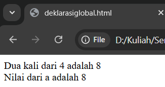

# Analisis Kode Program

## deklarasiglobal.html

- Baris 1: `` → Bagian kode HTML/JS lainnya.
- 
## deklarasilokal.html

- Baris 1: `<!DOCTYPE html>` → Deklarasi tipe dokumen HTML.
- Baris 2: `<html lang="en">` → Tag pembuka HTML.
- Baris 3: `<head>` → Bagian head dokumen HTML.
- Baris 4: `    <meta charset="UTF-8">` → Bagian kode HTML/JS lainnya.
- Baris 5: `    <meta name="viewport" content="width=device-width, initial-scale=1.0">` → Bagian kode HTML/JS lainnya.
- Baris 6: `    <title>Document</title>` → Judul halaman web.
- Baris 7: `</head>` → Akhir dari bagian head.
- Baris 8: `<body>` → Bagian body HTML tempat konten ditampilkan.
- Baris 9: `    ` → Bagian kode HTML/JS lainnya.
- Baris 19: `</body>` → Akhir dari body HTML.
- Baris 20: `</html>` → Tag penutup HTML.

## deklarasivar.html

- Baris 1: ` ` → Bagian kode HTML/JS lainnya.

## file.js

- Baris 1: `document.write("Ini adalah Penggunaan Javascript Eksternal");` → Bagian kode HTML/JS lainnya.

## hitungluasbangun.html

- Baris 1: `<!DOCTYPE html>` → Deklarasi tipe dokumen HTML.
- Baris 2: `<html lang="en">` → Tag pembuka HTML.
- Baris 3: `` → Baris kosong untuk pemisah.
- Baris 4: `<head>` → Bagian head dokumen HTML.
- Baris 5: `    <meta charset="UTF-8">` → Bagian kode HTML/JS lainnya.
- Baris 6: `    <meta name="viewport" content="width=device-width, initial-scale=1.0">` → Bagian kode HTML/JS lainnya.
- Baris 7: `    <title>Hitung Luas Bangun Ruang</title>` → Judul halaman web.
- Baris 8: `    ` → Bagian kode HTML/JS lainnya.
- Baris 24: `</head>` → Akhir dari bagian head.
- Baris 25: `` → Baris kosong untuk pemisah.
- Baris 26: `<body>` → Bagian body HTML tempat konten ditampilkan.
- Baris 27: `    <h1>Hitung Luas Bangun Ruang</h1>` → Heading atau judul konten di halaman.
- Baris 28: `` → Baris kosong untuk pemisah.
- Baris 29: `    <h3>1. Volume Kubus</h3>  ` → Heading atau judul konten di halaman.
- Baris 30: `    <label>Sisi : <input type="number" id="sisi"></label>` → Bagian kode HTML/JS lainnya.
- Baris 31: `    <button onclick="hitungKubus()">Hitung</button>` → Tombol interaktif.
- Baris 32: `    

` → Paragraf teks.
- Baris 33: `` → Baris kosong untuk pemisah.
- Baris 34: `    <h3>2. Volume Balok</h3>` → Heading atau judul konten di halaman.
- Baris 35: `    <label>Panjang: <input type="number" id="panjang"></label>` → Bagian kode HTML/JS lainnya.
- Baris 36: `    <label>Lebar: <input type="number" id="lebar"></label>` → Bagian kode HTML/JS lainnya.
- Baris 37: `    <label>Tinggi: <input type="number" id="tinggi"></label>` → Bagian kode HTML/JS lainnya.
- Baris 38: `    <button onclick="hitungBalok()">Hitung</button>` → Tombol interaktif.
- Baris 39: `    

` → Paragraf teks.
- Baris 40: `` → Baris kosong untuk pemisah.
- Baris 41: `    <h3>3. Volume Tabung</h3>` → Heading atau judul konten di halaman.
- Baris 42: `    <label>Jari-jari: <input type="number" id="jari"></label>` → Bagian kode HTML/JS lainnya.
- Baris 43: `    <label>Tinggi: <input type="number" id="tinggiTabung"></label>` → Bagian kode HTML/JS lainnya.
- Baris 44: `    <button onclick="hitungTabung()">Hitung</button>` → Tombol interaktif.
- Baris 45: `    

` → Paragraf teks.
- Baris 46: `` → Baris kosong untuk pemisah.
- Baris 47: `</body>` → Akhir dari body HTML.
- Baris 48: `` → Bagian kode HTML/JS lainnya.
- Baris 70: `` → Baris kosong untuk pemisah.
- Baris 71: `</html>` → Tag penutup HTML.

## input.html

- Baris 1: `<html>` → Tag pembuka HTML.
- Baris 2: `    <head>` → Bagian head dokumen HTML.
- Baris 3: `        <title>Masukan Data</title>` → Judul halaman web.
- Baris 4: `    </head>` → Akhir dari bagian head.
- Baris 5: `        <body>` → Bagian body HTML tempat konten ditampilkan.
- Baris 6: `            ` → Bagian kode HTML/JS lainnya.
- Baris 10: `        </body>` → Akhir dari body HTML.
- Baris 11: `</html>` → Tag penutup HTML.

## kalkulator.html

- Baris 1: `<!DOCTYPE html>` → Deklarasi tipe dokumen HTML.
- Baris 2: `<html lang="id">` → Tag pembuka HTML.
- Baris 3: `` → Baris kosong untuk pemisah.
- Baris 4: `<head>` → Bagian head dokumen HTML.
- Baris 5: `  <meta charset="UTF-8">` → Bagian kode HTML/JS lainnya.
- Baris 6: `  <title>Kalkulator Sederhana</title>` → Judul halaman web.
- Baris 7: `  ` → Bagian kode HTML/JS lainnya.
- Baris 28: `</head>` → Akhir dari bagian head.
- Baris 29: `` → Baris kosong untuk pemisah.
- Baris 30: `<body>` → Bagian body HTML tempat konten ditampilkan.
- Baris 31: `  
` → Bagian kode HTML/JS lainnya.
- Baris 32: `    <input type="text" id="display" disabled>` → Input field untuk pengguna.
- Baris 33: `     ` → Bagian kode HTML/JS lainnya.
- Baris 34: `    <button onclick="tampilan()">C</button>` → Tombol interaktif.
- Baris 35: `    <button onclick="nilai('/')">/</button>` → Tombol interaktif.
- Baris 36: `    <button onclick="nilai('*')">*</button>` → Tombol interaktif.
- Baris 37: `    <button onclick="nilai('-')">-</button>` → Tombol interaktif.
- Baris 38: `    <button onclick="nilai('+')">+</button>` → Tombol interaktif.
- Baris 39: `    <button onclick="hitung()">=</button>` → Tombol interaktif.
- Baris 40: `` → Baris kosong untuk pemisah.
- Baris 41: `     ` → Bagian kode HTML/JS lainnya.
- Baris 42: `    <button onclick="nilai('7')">7</button>` → Tombol interaktif.
- Baris 43: `    <button onclick="nilai('8')">8</button>` → Tombol interaktif.
- Baris 44: `    <button onclick="nilai('9')">9</button>` → Tombol interaktif.
- Baris 45: `` → Baris kosong untuk pemisah.
- Baris 46: `     ` → Bagian kode HTML/JS lainnya.
- Baris 47: `    <button onclick="nilai('4')">4</button>` → Tombol interaktif.
- Baris 48: `    <button onclick="nilai('5')">5</button>` → Tombol interaktif.
- Baris 49: `    <button onclick="nilai('6')">6</button>` → Tombol interaktif.
- Baris 50: `` → Baris kosong untuk pemisah.
- Baris 51: `     ` → Bagian kode HTML/JS lainnya.
- Baris 52: `    <button onclick="nilai('1')">1</button>` → Tombol interaktif.
- Baris 53: `    <button onclick="nilai('2')">2</button>` → Tombol interaktif.
- Baris 54: `    <button onclick="nilai('3')">3</button>` → Tombol interaktif.
- Baris 55: `    <button onclick="nilai('0')">0</button>` → Tombol interaktif.
- Baris 56: `    <button onclick="nilai('.')">.</button>` → Tombol interaktif.
- Baris 57: `     ` → Bagian kode HTML/JS lainnya.
- Baris 58: `` → Baris kosong untuk pemisah.
- Baris 59: `  
` → Bagian kode HTML/JS lainnya.
- Baris 60: `` → Baris kosong untuk pemisah.
- Baris 61: `  ` → Bagian kode HTML/JS lainnya.
- Baris 80: `</body>` → Akhir dari body HTML.
- Baris 81: `` → Baris kosong untuk pemisah.
- Baris 82: `</html>` → Tag penutup HTML.

## konversi.html

- Baris 1: `<!DOCTYPE html>` → Deklarasi tipe dokumen HTML.
- Baris 2: `<HTML>` → Bagian kode HTML/JS lainnya.
- Baris 3: `` → Baris kosong untuk pemisah.
- Baris 4: `<HEAD>` → Bagian kode HTML/JS lainnya.
- Baris 5: `    <TITLE>Konversi Bilangan</TITLE>` → Bagian kode HTML/JS lainnya.
- Baris 6: `</HEAD>` → Bagian kode HTML/JS lainnya.
- Baris 7: `` → Baris kosong untuk pemisah.
- Baris 8: `<BODY>` → Bagian kode HTML/JS lainnya.
- Baris 9: `    ` → Bagian kode HTML/JS lainnya.
- Baris 27: `</BODY>` → Bagian kode HTML/JS lainnya.
- Baris 28: `` → Baris kosong untuk pemisah.
- Baris 29: `</HTML>` → Bagian kode HTML/JS lainnya.

## operatoraritmatika.html

- Baris 1: `<html>` → Tag pembuka HTML.
- Baris 2: `` → Baris kosong untuk pemisah.
- Baris 3: `<head>` → Bagian head dokumen HTML.
- Baris 4: `    <title>Operasi Matematika</title>` → Judul halaman web.
- Baris 5: `</head>` → Akhir dari bagian head.
- Baris 6: `` → Baris kosong untuk pemisah.
- Baris 7: `<body>` → Bagian body HTML tempat konten ditampilkan.
- Baris 8: `    ` → Bagian kode HTML/JS lainnya.
- Baris 18: `</body>` → Akhir dari body HTML.
- Baris 19: `` → Baris kosong untuk pemisah.
- Baris 20: `</html>` → Tag penutup HTML.

## operatorlogic.html

- Baris 1: `<!DOCTYPE html>` → Deklarasi tipe dokumen HTML.
- Baris 2: `<html lang="en">` → Tag pembuka HTML.
- Baris 3: `` → Baris kosong untuk pemisah.
- Baris 4: `<head>` → Bagian head dokumen HTML.
- Baris 5: `    <meta charset="UTF-8">` → Bagian kode HTML/JS lainnya.
- Baris 6: `    <meta name="viewport" content="width=device-width, initial-scale=1.0">` → Bagian kode HTML/JS lainnya.
- Baris 7: `    <title>Document</title>` → Judul halaman web.
- Baris 8: `</head>` → Akhir dari bagian head.
- Baris 9: `` → Baris kosong untuk pemisah.
- Baris 10: `<body>` → Bagian body HTML tempat konten ditampilkan.
- Baris 11: `    ` → Bagian kode HTML/JS lainnya.
- Baris 17: `</body>` → Akhir dari body HTML.
- Baris 18: `` → Baris kosong untuk pemisah.
- Baris 19: `</html>` → Tag penutup HTML.

## percobaan1.html

- Baris 1: `<HTML>` → Bagian kode HTML/JS lainnya.
- Baris 2: `` → Baris kosong untuk pemisah.
- Baris 3: `<HEAD>` → Bagian kode HTML/JS lainnya.
- Baris 4: `    <TITLE>Contoh Program Javascript</TITLE>` → Bagian kode HTML/JS lainnya.
- Baris 5: `    ` → Bagian kode HTML/JS lainnya.
- Baris 8: `</HEAD>` → Bagian kode HTML/JS lainnya.
- Baris 9: `` → Baris kosong untuk pemisah.
- Baris 10: `<BODY>` → Bagian kode HTML/JS lainnya.
- Baris 11: `    ` → Bagian kode HTML/JS lainnya.
- Baris 14: `` → Baris kosong untuk pemisah.
- Baris 15: `</BODY>` → Bagian kode HTML/JS lainnya.
- Baris 16: `` → Baris kosong untuk pemisah.
- Baris 17: `</HTML>` → Bagian kode HTML/JS lainnya.

## percobaanbutton.html

- Baris 1: `<!DOCTYPE html>` → Deklarasi tipe dokumen HTML.
- Baris 2: `<html>` → Tag pembuka HTML.
- Baris 3: `` → Baris kosong untuk pemisah.
- Baris 4: `<head>` → Bagian head dokumen HTML.
- Baris 5: `    <title>Belajar Javascript : Mengenal Event Pada Javascript</title>` → Judul halaman web.
- Baris 6: `</head>` → Akhir dari bagian head.
- Baris 7: `` → Baris kosong untuk pemisah.
- Baris 8: `<body>` → Bagian body HTML tempat konten ditampilkan.
- Baris 9: `    <h1>Mengenal Event Pada JS</h1>` → Heading atau judul konten di halaman.
- Baris 10: `    <h2>Event one click</h2>` → Heading atau judul konten di halaman.
- Baris 11: `    <button onclick="tampilkan_nama()">Klik disini </button>` → Tombol interaktif.
- Baris 12: `` → Baris kosong untuk pemisah.
- Baris 13: `    

` → Bagian kode HTML/JS lainnya.
- Baris 14: `` → Baris kosong untuk pemisah.
- Baris 15: `    ` → Bagian kode HTML/JS lainnya.
- Baris 21: `</body>` → Akhir dari body HTML.
- Baris 22: `` → Baris kosong untuk pemisah.
- Baris 23: `</html>` → Tag penutup HTML.

## percobaaneksternal.html

- Baris 1: `<!DOCTYPE html>` → Deklarasi tipe dokumen HTML.
- Baris 2: `<html lang="en">` → Tag pembuka HTML.
- Baris 3: `<head>` → Bagian head dokumen HTML.
- Baris 4: `    <meta charset="UTF-8">` → Bagian kode HTML/JS lainnya.
- Baris 5: `    <meta name="viewport" content="width=device-width, initial-scale=1.0">` → Bagian kode HTML/JS lainnya.
- Baris 6: `    <title>Document</title>` → Judul halaman web.
- Baris 7: `</head>` → Akhir dari bagian head.
- Baris 8: `<body>` → Bagian body HTML tempat konten ditampilkan.
- Baris 9: `      ` → Baris kosong untuk pemisah.
- Baris 10: `` → Bagian kode HTML/JS lainnya.
- Baris 11: `</body>` → Akhir dari body HTML.
- Baris 12: `</html>` → Tag penutup HTML.

## percobaansederhana.html

- Baris 1: `<html>` → Tag pembuka HTML.
- Baris 2: `<head>` → Bagian head dokumen HTML.
- Baris 3: `    <title> contoh sederhana JavaScript</title>` → Judul halaman web.
- Baris 4: `</head>` → Akhir dari bagian head.
- Baris 5: `    </body>` → Akhir dari body HTML.
- Baris 6: `        ` → Bagian kode HTML/JS lainnya.
- Baris 10: `    </body>` → Akhir dari body HTML.
- Baris 11: `</html>` → Tag penutup HTML.

## tugas1.html

- Baris 1: `<!DOCTYPE html>` → Deklarasi tipe dokumen HTML.
- Baris 2: `<html lang="en">` → Tag pembuka HTML.
- Baris 3: `` → Baris kosong untuk pemisah.
- Baris 4: `<head>` → Bagian head dokumen HTML.
- Baris 5: `    <meta charset="UTF-8">` → Bagian kode HTML/JS lainnya.
- Baris 6: `    <meta name="viewport" content="width=device-width, initial-scale=1.0">` → Bagian kode HTML/JS lainnya.
- Baris 7: `    <title>Document</title>` → Judul halaman web.
- Baris 8: `</head>` → Akhir dari bagian head.
- Baris 9: `` → Baris kosong untuk pemisah.
- Baris 10: `<body>` → Bagian body HTML tempat konten ditampilkan.
- Baris 11: `    ` → Bagian kode HTML/JS lainnya.
- Baris 33: `</body>` → Akhir dari body HTML.
- Baris 34: `` → Baris kosong untuk pemisah.
- Baris 35: `</html>` → Tag penutup HTML.

## tugas2.html

- Baris 1: `<!DOCTYPE html>` → Deklarasi tipe dokumen HTML.
- Baris 2: `<html lang="en">` → Tag pembuka HTML.
- Baris 3: `` → Baris kosong untuk pemisah.
- Baris 4: `<head>` → Bagian head dokumen HTML.
- Baris 5: `    <meta charset="UTF-8">` → Bagian kode HTML/JS lainnya.
- Baris 6: `    <meta name="viewport" content="width=device-width, initial-scale=1.0">` → Bagian kode HTML/JS lainnya.
- Baris 7: `    <title>Document</title>` → Judul halaman web.
- Baris 8: `</head>` → Akhir dari bagian head.
- Baris 9: `` → Baris kosong untuk pemisah.
- Baris 10: `<body>` → Bagian body HTML tempat konten ditampilkan.
- Baris 11: `    ` → Bagian kode HTML/JS lainnya.
- Baris 23: `</body>` → Akhir dari body HTML.
- Baris 24: `` → Baris kosong untuk pemisah.
- Baris 25: `</html>` → Tag penutup HTML.

## warning.html

- Baris 1: `<HTML>` → Bagian kode HTML/JS lainnya.
- Baris 2: `` → Baris kosong untuk pemisah.
- Baris 3: `<HEAD>` → Bagian kode HTML/JS lainnya.
- Baris 4: `    <TITLE>Alert Box</TITLE>` → Bagian kode HTML/JS lainnya.
- Baris 5: `</HEAD>` → Bagian kode HTML/JS lainnya.
- Baris 6: `` → Baris kosong untuk pemisah.
- Baris 7: `<BODY>` → Bagian kode HTML/JS lainnya.
- Baris 8: `    ` → Bagian kode HTML/JS lainnya.
- Baris 14: `</BODY>` → Bagian kode HTML/JS lainnya.
- Baris 15: `` → Baris kosong untuk pemisah.
- Baris 16: `</HTML>` → Bagian kode HTML/JS lainnya.

## warning2.html

- Baris 1: `<html>` → Tag pembuka HTML.
- Baris 2: `` → Baris kosong untuk pemisah.
- Baris 3: `<head>` → Bagian head dokumen HTML.
- Baris 4: `    <title>Konfirmasi</title>` → Judul halaman web.
- Baris 5: `</head>` → Akhir dari bagian head.
- Baris 6: `` → Baris kosong untuk pemisah.
- Baris 7: `<body>` → Bagian body HTML tempat konten ditampilkan.
- Baris 8: `    ` → Bagian kode HTML/JS lainnya.
- Baris 13: `</body>` → Akhir dari body HTML.
- Baris 14: `` → Baris kosong untuk pemisah.
- Baris 15: `</html>` → Tag penutup HTML.

